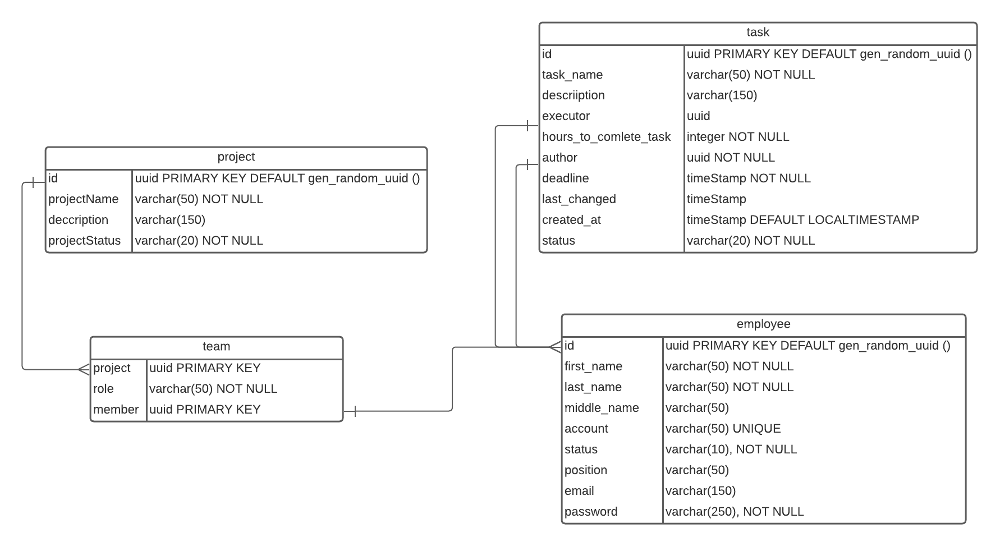

Отношения
_________

employee
---------

Таблица содержит записи о сотрудниках.

| Наименование поля |   Тип поля   |                                                Комментарий |
|----------------|:------------:|-----------------------------------------------------------:|
| id             |     UUID     | Первичный ключ,значения по умолчанию генерируются случайно |
| position       | varchar(50)  |                     Должнось сотрудника. Обязательное поле |
| account        |     UUID     |                       Учетная запись. Не Обязательное поле |
| lastname       | varchar(50)  |                      Фамилия сотрудника. Обязательное поле |
| firstname      | varchar(50)  |                          Имя сотрудника. Обязательное поле |
| middlename     | varchar(50)  |                  Отчество сотрудника. Не обязательное поле |
| email          | varchar(150) |                     Email сотрудника. Не обязательное поле |
| status         | varchar(20)  |                       Статус сотрудника. обязательное поле |

project
-------
Таблица содержит записи о проектах с указанием id проекта, названия, описания и статуса.

| Наименование поля |   Тип поля   |                                                Комментарий |
|-------------------|:------------:|-----------------------------------------------------------:|
| project_id        |     UUID     | Первичный ключ,значения по умолчанию генерируются случайно |
| project_name      | varchar(50)  |                    Наименование проекта. Обязательное поле |
| description       | varchar(150) |                     Описание проекта. Не обязательное поле |
| project_status    | varchar(20)  |                          Статус проекта. Обязательное поле |

team
-------------------
Таблица содержит записи о командах. Команда проекта состоит из списка связей: проект - сотрудник - роль в проекте.
Первичный ключ(project, member). Сотрудник может принимать различные роли, но только одну роль внутри проекта

| Наименование поля |  Тип поля   |                                                                                                 Комментарий |
|-------------------|:-----------:|------------------------------------------------------------------------------------------------------------:|
| project           |    UUID     | Первичный ключ. Идентификатор проекта. Связь с полем project_id в таблице project отношение один ко многим. |
| role              | varchar(50) |                                                               Роль сотрудника в проекте. Обязательное поле. |
| member            |    uuid     |     Первичный ключ. Идентификатор сотрудника. Связь с полем id в таблице employee отношение один ко многим. |

task
-------------------
Таблица содержит записи о задачах, создданых сотрудниками.

| Наименование поля     |   Тип поля   |                                                                                                           Комментарий |
|-----------------------|:------------:|----------------------------------------------------------------------------------------------------------------------:|
| id                    |     UUID     |                                      Первичный ключ. Идентификатор задачи.Значения по умолчанию генерируются случайно |
| task_name             | varchar(50)  |                                                                                Наименование задачи. Обязательное поле |
| description           | varchar(150) |                                                                                 Описание задачи. Не обязательное поле |
| executor              |     uuid     | Исполнитель задачи. Внешний ключ. Не обязательное поле. Связь с полем id в таблице employee отношение один ко многим. |
| hours_to_comlete_task |   Integer    |                                                                 Время на выполнения задачи в часах. Обязательное поле |
| deadline              |  timestamp   |                                                                     Крайний срок выполнения задачи. Обязательное поле |
| status                | varchar(20)  |                                                                                      Статус задачи. Обязательное поле |
| author                |     uuid     |          Автор задачи. Внешний ключ. Обязательное поле. Связь с полем id в таблице employee отношение один ко многим. |
| created_at            |  timestamp   |                               Дата и время создания задачи.В значение по умолчанию записывается текущие дата и время. |
| last_changed          |  timestamp   |                                                               Дата последнего изменения задачи. Не обязательное поле. | 